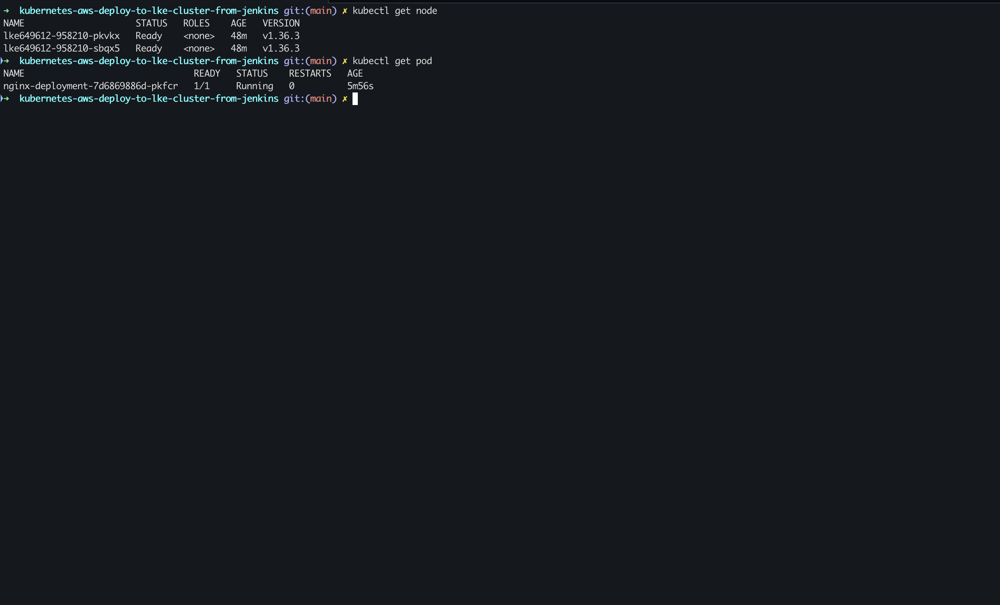
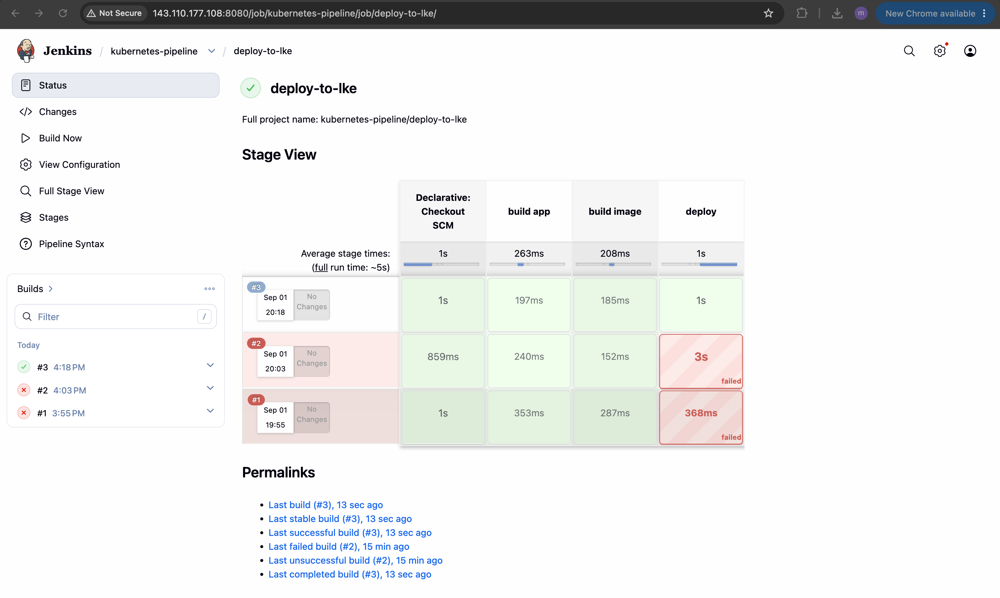

# Kubernetes on Linode - Deploy to LKE Cluster from Jenkins

Kubernetes (often abbreviated as K8s) is an open-source container orchestration platform designed to automate the deployment, scaling, management, and networking of containerized applications across a cluster of hosts.

Linode Kubernetes Engine (LKE) is Linode's managed Kubernetes service that provisions and manages Kubernetes control planes and worker nodes. LKE provides a web console and API for creating clusters, node pools, and networking resources, integrates with Linode block storage and load balancers, and exposes kubeconfig files for cluster access.

## Overview


Jenkins is an open-source automation server used to build, test, and deploy software. Jenkins pipelines are declarative or scripted workflows that run build/test/deploy steps; Jenkins supports many plugins (including the Kubernetes CLI plugin) which provide `withKubeConfig` and other helpers to interact with Kubernetes clusters securely.

This project demonstrates how to provision a Linode LKE cluster with a managed node group, and deploy sample applications to the cluster from a Jenkins pipeline.

### Linode LKE key features

- Managed Kubernetes control plane with automated upgrades and health monitoring
- Node pools (managed worker node groups) with flexible instance types
- Integrated Linode Block Storage and Load Balancers for persistent volumes and service exposure
- Cluster API and console for kubeconfig download, networking, and autoscaling controls

## Demo Project

CD - Deploy to LKE cluster from Jenkins Pipeline

## Technologies used

- Kubernetes
- Jenkins
- Linode LKE
- Docker
- Linux

## Project Description

- Create K8s cluster on LKE
- Install kubectl as Jenkins Plugin
- Adjust Jenkinsfile to use Plugin and deploy to LKE cluster

## Repository structure

```text
Kubernetes on Linode - Deploy to LKE Cluster from Jenkins/
├── Dockerfile
├── Jenkinsfile
├── pom.xml
├── src/
├── images/
│   ├── eksctl-cluster-create-terminal.png
│   ├── eksctl-cluster-cloudformation-stacks-console.png
│   ├── eksctl-cluster-nodes-console.png
│   ├── jenkins-pipeline-deploy-to-lke.png
│   ├── nginx-pod-deployed-terminal.png
│   └── jenkins-pipeline-deploy-on-k8s.png
├── commands.md
├── README.md
└── .gitignore
```

## Architecture overview

High level flow:


Key points:

- Jenkins builds the image and pushes to a registry
- Jenkins authenticates to Kubernetes using a kubeconfig stored as a secret file
- The LKE cluster pulls the image from the registry and runs pods on worker nodes

## Implementation Guide

### 1. Prerequisites

Before starting, ensure you have the following:

- Linode account with permissions to create LKE clusters
- A Linux VM or server to run Jenkins (or an existing Jenkins installation)
- SSH access to the Jenkins host (key or password) to install Docker or restart the container
- Docker installed on the Jenkins host (for running Jenkins in a container)
- Jenkins admin access to install plugins and add credentials
- `kubectl` available on the Jenkins agent (or use the Kubernetes CLI plugin to provide it)

### 2. Create LKE cluster

Create an LKE cluster "test" using the Linode Cloud Manager or the Linode CLI and download the kubeconfig for the cluster (named `test-kubeconfig.yaml`).

### 3. Prepare Jenkins (install tools)

Create a virtual machine, install Docker and run Jenkins as a container, then SSH to the server to manage it.

Example commands (adapt the host/user to your environment). These match the patterns used in the demo — see the referenced repo for more examples: https://github.com/mustafa-saleh/build-automation-and-ci-cd-with-jenkins

```bash
# SSH to the Jenkins host
ssh user@jenkins-host-ip

# Update packages (Debian/Ubuntu example)
sudo apt-get update && sudo apt-get install -y apt-transport-https ca-certificates curl gnupg lsb-release

# Install Docker (official convenience script)
curl -fsSL https://get.docker.com -o get-docker.sh
sh get-docker.sh

# Run Jenkins container (example)
docker run -d --name jenkins -p 8080:8080 -p 50000:50000 -v jenkins_home:/var/jenkins_home jenkins/jenkins:lts
```

### 5. Provide kubeconfig credentials to Jenkins for Authentication

Add the downloaded kubeconfig file to Jenkins as a **Secret file** credential and reference it by the `credentialsId` used in the pipeline (`lke-credentials`):

1. Open Jenkins → Pipeline → Credentials → Global credentials → Add Credentials.
2. For **Kind** select **Secret file**.
3. Click **Choose File** and upload `test-kubeconfig.yaml`.
4. Set **ID** to `lke-credentials` (or note the generated ID and use it in your `Jenkinsfile`).
5. Save the credential.

The pipeline uses `withKubeConfig([credentialsId: 'lke-credentials', serverUrl: '<LINODE_K8S_API_ENDPOINT_URL>'])` to load the kubeconfig during the `deploy` stage. Jenkins will mount the secret file into the build workspace and `withKubeConfig` will configure `kubectl` to use it.

### 6. Jenkins pipeline (build, push, deploy)

Example `Jenkinsfile`:

```groovy
#!/usr/bin/env groovy

pipeline {
    agent any
    stages {
        stage('build app') {
            steps {
                script {
                    echo "building the application..."
                }
            }
        }
        stage('build image') {
            steps {
                script {
                    echo "building the docker image..."
                }
            }
        }
        stage('deploy') {
            steps {
                script {
                    echo 'deploying docker image...'
                    withKubeConfig([credentialsId: 'lke-credentials', serverUrl: 'https://06a60f3f-c840-426c-b9bd-c6b420b0833e.in-maa-1-gw.linodelke.net']) {
                            sh 'kubectl create deployment nginx-deployment --image=nginx'
                    }
                }
            }
        }
    }
}
```

### 7. Validate deployment (commands)

```bash
kubectl get pods -n default
kubectl get svc -n default
kubectl describe deployment <depl-name>
kubectl logs <pod-name>
```



## Final result

The pipeline successfully builds, pushes and deploys the application to the LKE cluster. See screenshots in `images/` for evidence of cluster creation and a successful Jenkins pipeline run.



## References

- Linode LKE docs: https://www.linode.com/docs/guides/introduction-to-lke/
- Jenkins Kubernetes CLI Plugin: https://plugins.jenkins.io/kubernetes-cli/
- kubectl: https://kubernetes.io/docs/tasks/tools/

