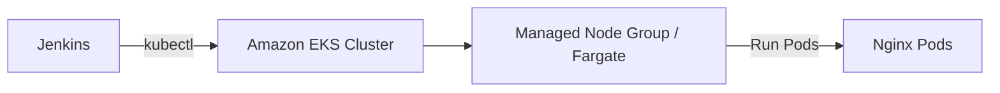

# Kubernetes on Linode - Deploy to LKE Cluster from Jenkins

Kubernetes (often abbreviated as K8s) is an open-source container orchestration platform designed to automate the deployment, scaling, management, and networking of containerized applications across a cluster of hosts.

[define linode lke]

## Overview

[define jenkins]

This project demonstrates how to provision a Linode LKE cluster with a managed node group, and deploy sample applications to the cluster from Jenkins pipeline.

### Linode LKE key features

- 
- 
- 
- 

## Demo Project

CD - Deploy to LKE cluster from Jenkins Pipeline

## Technologies used

- Kubernetes
- Jenkins
- Linode LKE
- Docker
- Linux

## Project Description

- Create K8s cluster on LKE
- Install kubectl as Jenkins Plugin
- Adjust Jenkinsfile to use Plugin and deploy to LKE cluster

## Repository structure

```text
Kubernetes on Linode - Deploy to LKE Cluster from Jenkins/
├── Dockerfile
├── Jenkinsfile
├── pom.xml
├── src/
├── images/
│   ├── eksctl-cluster-create-terminal.png
│   ├── eksctl-cluster-cloudformation-stacks-console.png
│   ├── eksctl-cluster-nodes-console.png
│   └── jenkins-pipeline-deploy-on-k8s.png
├── commands.md
├── README.md
└── .gitignore
```

## Architecture overview

High level flow:



Key points:

- Jenkins builds the image and pushes to registry
- Jenkins authenticates to Kubernetes using a kubeconfig
- Kubernetes pulls the image from registry and runs pods on worker nodes

## Implementation Guide

### 1. Prerequisites


### 2. Create or use an existing EKS cluster


### 3. Prepare Jenkins (install tools)

Create a virtual machine, install docker & run Jenkins as a container and ssh to the server.

Install plugin

### 5. Provide kubeconfig credentials to Jenkins for Authentication


### 6. Jenkins pipeline (build, push, deploy)

Example `Jenkinsfile`:

```groovy
#!/usr/bin/env groovy

pipeline {
    agent any
    stages {
        stage('build app') {
            steps {
                script {
                    echo "building the application..."
                }
            }
        }
        stage('build image') {
            steps {
                script {
                    echo "building the docker image..."
                }
            }
        }
        stage('deploy') {
            steps {
                script {
                    echo 'deploying docker image...'
                    withKubeConfig([credentialsId: 'lke-credentials', serverUrl: 'https://06a60f3f-c840-426c-b9bd-c6b420b0833e.in-maa-1-gw.linodelke.net']) {
                            sh 'kubectl create deployment nginx-deployment --image=nginx'
                    }
                }
            }
        }
    }
}
```

### 7. Validate deployment (commands)

```bash
kubectl get pods -n default
kubectl get svc -n default
kubectl describe deployment <depl-name>
kubectl logs <pod-name>
```

## Final result

The pipeline successfully builds, pushes and deploys the application to EKS. See screenshots in `images/` for evidence of cluster creation and a successful Jenkins pipeline run.


## References

- 
- 
- kubectl: https://kubernetes.io/docs/tasks/tools/

