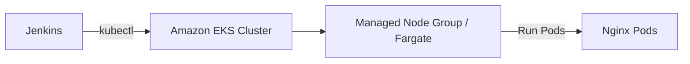
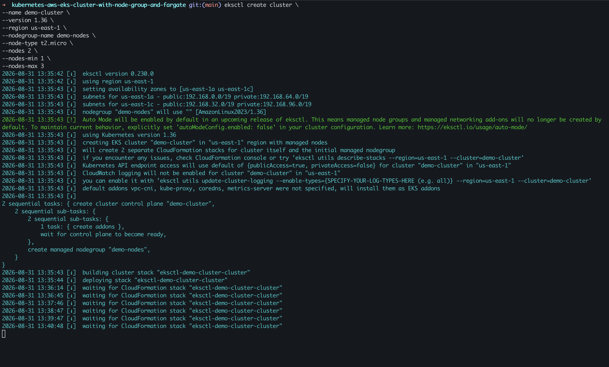
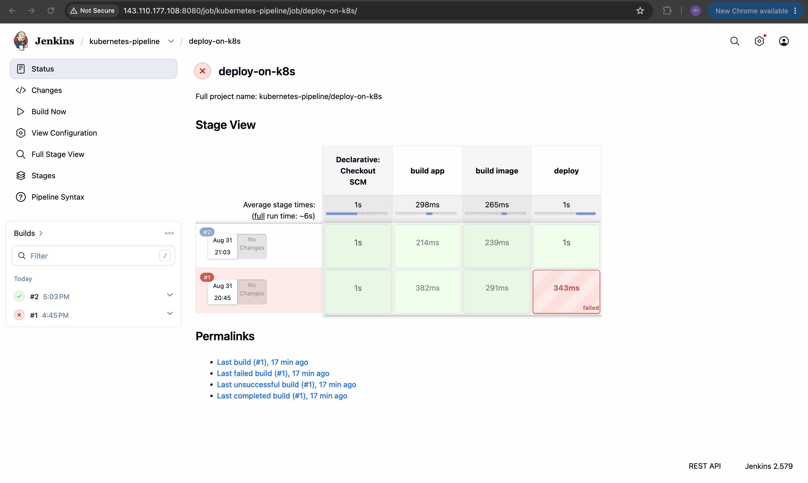

# Kubernetes on AWS - Deploy to LKE Cluster from Jenkins

Kubernetes (often abbreviated as K8s) is an open-source container orchestration platform designed to automate the deployment, scaling, management, and networking of containerized applications across a cluster of hosts.

Amazon Elastic Kubernetes Service (Amazon EKS) is a fully managed Kubernetes service that lets us run production-grade Kubernetes clusters on AWS without managing the control plane ourselves.

## Overview

Kubernetes on AWS using eksctl — a lightweight CLI that automates EKS cluster creation and common tasks. eksctl is a simple, declarative CLI that wraps the EKS APIs and CloudFormation to create a working Kubernetes cluster. 

This project demonstrates how to provision an Amazon EKS cluster with a managed node group, and deploy sample applications to the cluster from Jenkins pipeline.

### Amazon EKS key features

- Managed control plane with high availability across Availability Zones
- Managed Node Groups and optional Fargate profiles for serverless pods
- Integration with IAM, OIDC/IRSA for fine-grained permissions
- Autoscaling via Cluster Autoscaler + ASGs and native AWS networking

## Demo Project

CD - Deploy to EKS cluster from Jenkins Pipeline

## Technologies used

- Kubernetes (Amazon EKS)
- Jenkins (Pipeline)
- Docker, Maven
- AWS CLI, `eksctl`, `aws-iam-authenticator`
- `kubectl`

## Project Description

- Install `kubectl` and `aws-iam-authenticator` on a Jenkins server
- Create kubeconfig file to connect to EKS cluster and add it on Jenkins server
- Add AWS credentials on Jenkins for AWS account authentication
- Extend and adjust Jenkinsfile of the previous CI/CD pipeline to configure connection to EKS cluster

## Repository structure

```text
java-maven-app/
├── Dockerfile
├── Jenkinsfile
├── pom.xml
├── src/
├── images/
│   ├── eksctl-cluster-create-terminal.png
│   ├── eksctl-cluster-cloudformation-stacks-console.png
│   ├── eksctl-cluster-nodes-console.png
│   └── jenkins-pipeline-deploy-on-k8s.png
├── commands.md
├── README.md
└── .gitignore
```

## Architecture overview

High level flow:



Key points:

- Jenkins builds the image and pushes to registry
- Jenkins authenticates to Kubernetes using a kubeconfig that leverages AWS credentials
- Kubernetes pulls the image from registry and runs pods on worker nodes

## Implementation Guide

### 1. Prerequisites

- AWS account with permissions for EKS, IAM, EC2, ECR, CloudFormation
- `aws` CLI configured (run `aws configure`)
- `eksctl` installed for cluster creation
- `kubectl` locally for verification
- Docker for building images
- Jenkins server or container for running the pipeline

### 2. Create or use an existing EKS cluster

Quick `eksctl` example (adjust region, version, node type):

```bash
eksctl create cluster \
	--name demo-cluster \
	--region us-east-1 \
	--version 1.36 \
	--nodegroup-name demo-nodes \
	--node-type t3.medium \
	--nodes 2
```

This creates the control plane, VPC, and a managed node group.



### 3. Prepare Jenkins (install tools)

Create a virtual machine, install docker & run Jenkins as a container and ssh to the server.

execute root shell on jenkins container to install kubectl. Install kubectl commands (inside Jenkins container):

```bash
docker ps

# root shell on jenkins container
docker exec -u 0 -it <container-id> bash

# Install kubectl on Jenkins server
curl -LO https://storage.googleapis.com/kubernetes-release/release/$(curl -s https://storage.googleapis.com/kubernetes-release/release/stable.txt)/bin/linux/amd64/kubectl; chmod +x ./kubectl; mv ./kubectl /usr/local/bin/kubectl

# check installation
kubectl version

# install aws-iam-authenticator
curl -Lo aws-iam-authenticator https://github.com/kubernetes-sigs/aws-iam-authenticator/releases/download/v0.6.11/aws-iam-authenticator_0.6.11_linux_amd64

chmod +x ./aws-iam-authenticator

mv ./aws-iam-authenticator /usr/local/bin

aws-iam-authenticator help
```

### 4. Create a kubeconfig for Jenkins

Below is a sample config file according to AWS documentation, fill the placeholders from the (~/.kube/config) or the AWS console

```yaml
apiVersion: v1
kind: Config
clusters:
- cluster:
    certificate-authority-data: <certificate-data>
    server: <endpoint-url>
  name: kubernetes
contexts:
- context:
    cluster: kubernetes
    user: aws
  name: aws
current-context: aws
users:
- name: aws
  user:
    exec:
      apiVersion: client.authentication.k8s.io/v1beta1
      command: /usr/local/bin/aws-iam-authenticator
      args:
        - "token"
        - "-i"
        - <cluster-name>
```

Move the file inside the jenkins container in the directory (/var/jenkins_home/.kube/config)

```bash
# Copy config file to Jenkins server
docker cp config "YOUR DOCKER CONTAINER ID":/var/jenkins_home/.kube/
```

### 5. Provide AWS credentials to Jenkins for Authentication

We need credentials for AWS user (create IAM user for jenkins with limited permissions)

In Jenkins, create multi branch pipeline. Add new credentials of type "secret text" for aws "access-key-id" & "secret-access-key". copy the values from (~/aws/credentials)

```text
jenkins_aws_access_key_id
jenkins-aws_secret_access_key
```

### 6. Jenkins pipeline (build, push, deploy)

Example `Jenkinsfile`:

```groovy
#!/usr/bin/env groovy

pipeline {
    agent any
    stages {
        stage('build app') {
            steps {
               script {
                   echo "building the application..."
               }
            }
        }
        stage('build image') {
            steps {
                script {
                    echo "building the docker image..."
                }
            }
        }
        stage('deploy') {
            // aws-iam-authenticator is executed in the background & following variables needs to be set
            environment {
                AWS_ACCESS_KEY_ID = credentials('jenkins_aws_access_key_id')
                AWS_SECRET_ACCESS_KEY = credentials('jenkins-aws_secret_access_key')
            }
            steps {
                script {
                   echo 'deploying docker image...'
                   sh 'kubectl create deployment nginx-deployment --image=nginx'
                }
            }
        }
    }
}
```

### 7. Validate deployment (commands)

```bash
kubectl get pods -n default
kubectl get svc -n default
kubectl describe deployment <depl-name>
kubectl logs <pod-name>
```

## Final result

The pipeline successfully builds, pushes and deploys the application to EKS. See screenshots in `images/` for evidence of cluster creation and a successful Jenkins pipeline run.



## References

- eksctl: https://github.com/eksctl-io/eksctl
- AWS EKS docs: https://docs.aws.amazon.com/eks/
- kubectl: https://kubernetes.io/docs/tasks/tools/

